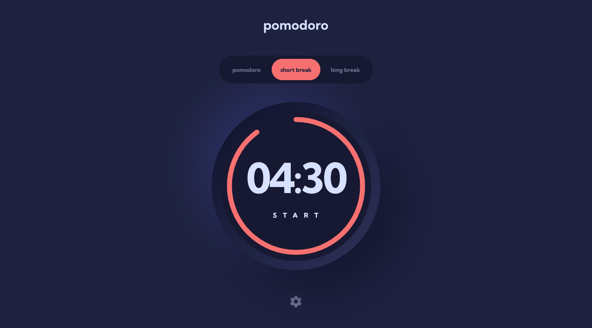
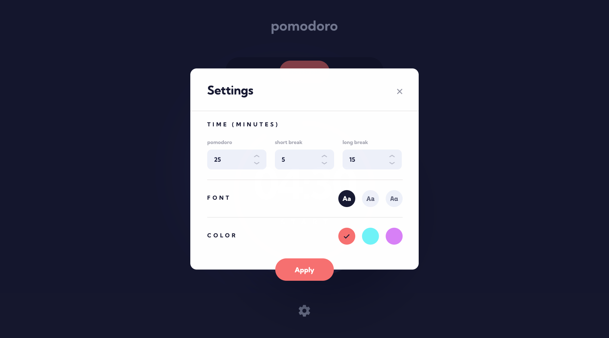
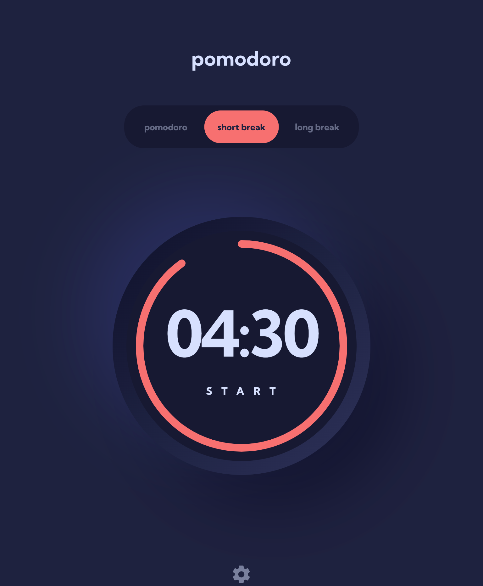
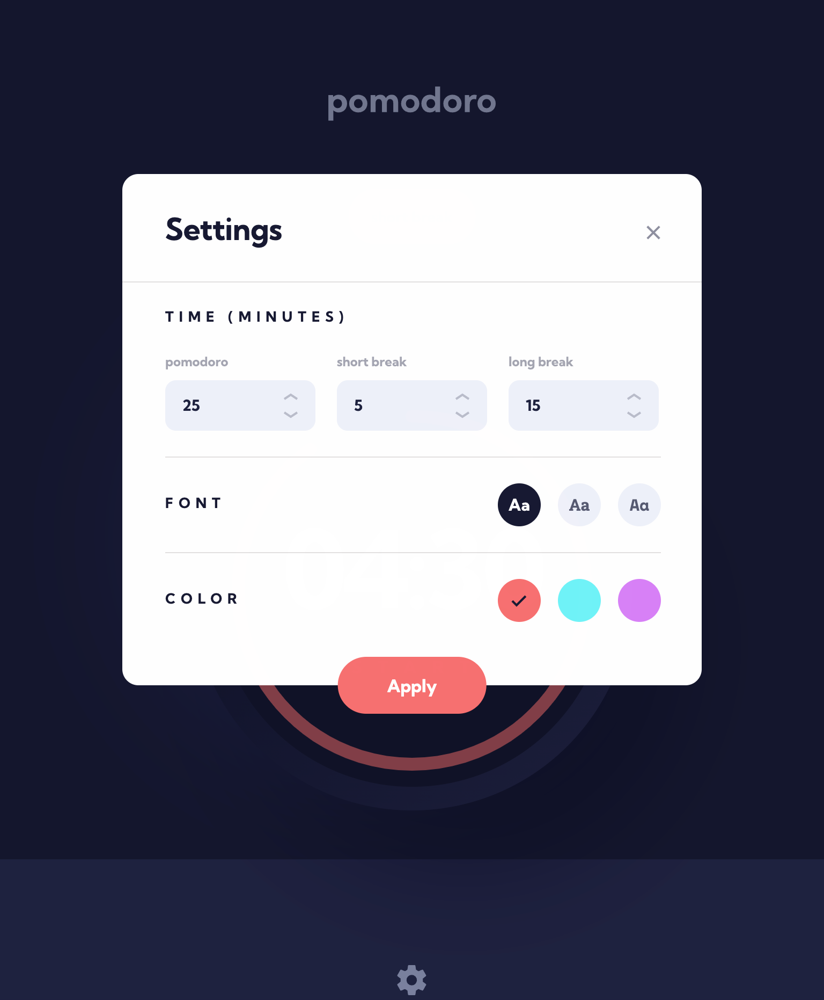
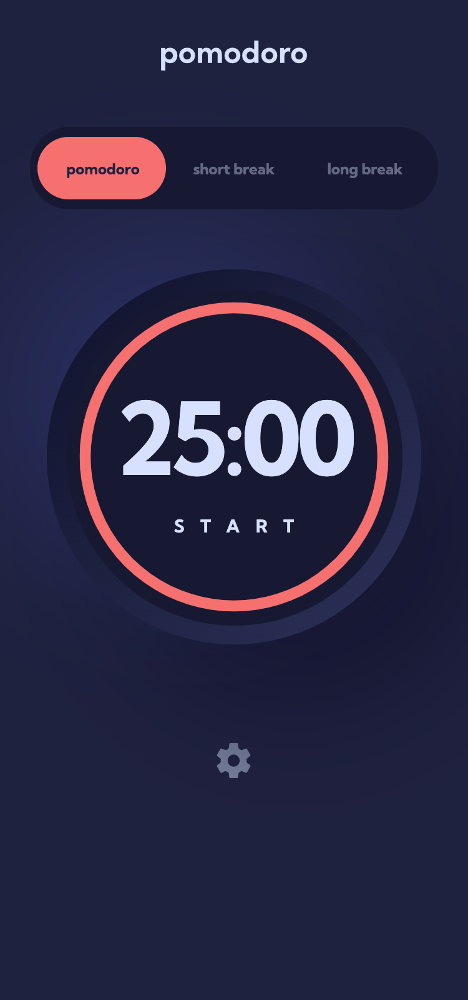
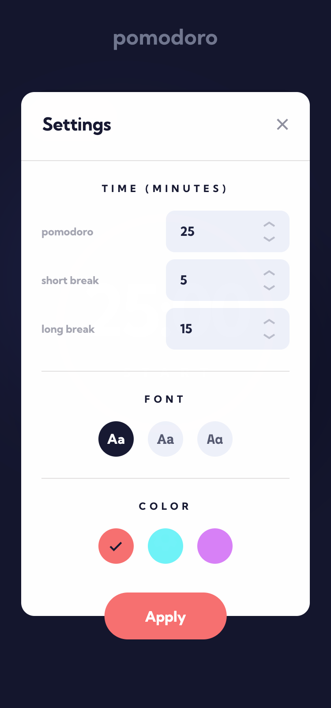
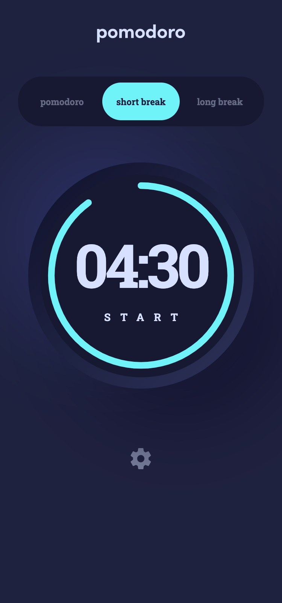

# Frontend Mentor - Pomodoro app solution

This is a solution to the [Pomodoro app challenge on Frontend Mentor](https://www.frontendmentor.io/challenges/pomodoro-app-KBFnycJ6G). Frontend Mentor challenges help you improve your coding skills by building realistic projects.

## Table of contents

- [Overview](#overview)
  - [The challenge](#the-challenge)
  - [Screenshot](#screenshot)
  - [Links](#links)
- [My process](#my-process)
  - [Built with](#built-with)
- [Author](#author)

## Overview

### The challenge

Users should be able to:

- Set a pomodoro timer and short & long break timers
- Customize how long each timer runs for
- See a circular progress bar that updates every minute and represents how far through their timer they are
- Customize the appearance of the app with the ability to set preferences for colors and fonts

### Screenshot
* Desktop (default, settings)

* Tablet (default, settings)

* Mobile (default, settings, custom)

### Links

- Solution URL: [Pomodoro App using NextJS](https://www.frontendmentor.io/solutions/pomodoro-app-using-nextjs-_bPWGknB8)
- Live Site URL: [Pomodoro App](https://pomodoro-app-hanseonglee.vercel.app/)

## My process

### Built with

- Semantic HTML5 markup
- CSS custom properties
- CSS animation
- SS Grid
- Flexbox
- Mobile-first workflow
- [React](https://reactjs.org/) - JS library
- [Next.js](https://nextjs.org/) - React framework
- [Sass/SCSS](https://sass-lang.com/) - For styles

## Author

- Frontend Mentor - [@HanSeongLee](https://www.frontendmentor.io/profile/HanSeongLee)
